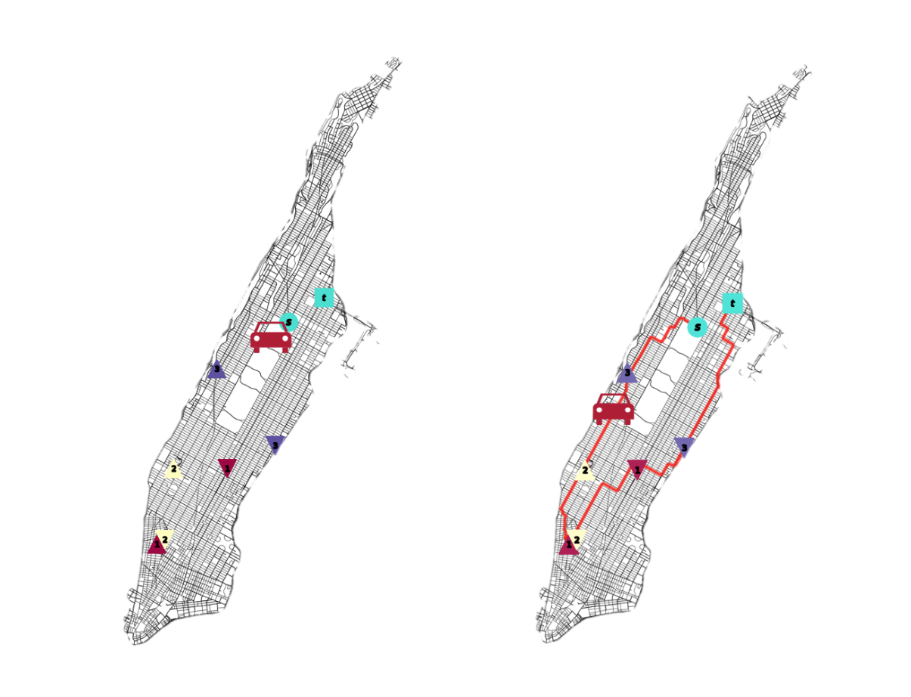

Welcome to pdpy's documentation!
================================

pdpy is a Python package for working with instances of the Pickup Delivery Problem (:ref:`PDP<PDP>`). 
This package generates instances of the PDP from the user's input and provides a toolbox for solving these instances through 
combinatorial or IP (Integer Programming) methods. 

Overview
========

This package works with instances of the Pickup Delivery Problem in the form of `NetworkX <https://networkx.github.io>`_ graphs.

.. _PDP:

What is the Pickup Delivery Problem?
------------------------------------

The Pickup Delivery Problem (PDP: see the `Dial-A-Ride Problem <https://link.springer.com/article/10.1007/s10479-007-0170-8>`_ and the `Vehicle Routing Problem <https://en.wikipedia.org/wiki/Vehicle_routing_problem>`_) is a generalization of the more commonly known `Traveling Salesman Problem (TSP) <https://en.wikipedia.org/wiki/Travelling_salesman_problem>`_. In the simplest terms, a vehicle which starts at a source depot **s**, must pickup and deliver a series of requests before returning to a target depot **t** and finally back to **s**. The pickup and delivery points have specified origin-destination locations known to the vehicle. The objective, then is to find a route that minimizes the travel distance required to complete all requests in this circuit. Each pickup-delivery request is ordered: a delivery can only be made once the respective pickup has been made. There is, however, no required order for satisfying all the requests and multiple pickups can be "in" a vehicle at any given time.

As an example, a ride-share driver has received *3* requests in Manhattan, each providing a pick up location and a drop off location. The driver leaves their home (**s**) and, following some planned route, completes the pickup and drop-off requests, the driver then goes to a gas station to refuel (**t**) before returning home (**s**).
   

This package allows the user to generate instances or input their own for experimentation with the PDP. The package provides graph handling methods that also make solving instances of this problem as easy and straightforward as calling a function on a user-provided or package generated graph. 

.. toctree::
   :maxdepth: 3
   :caption: Contents:

   intro
   modules

Indices
^^^^^^^

* :ref:`genindex`
* :ref:`modindex`
* :ref:`search`

