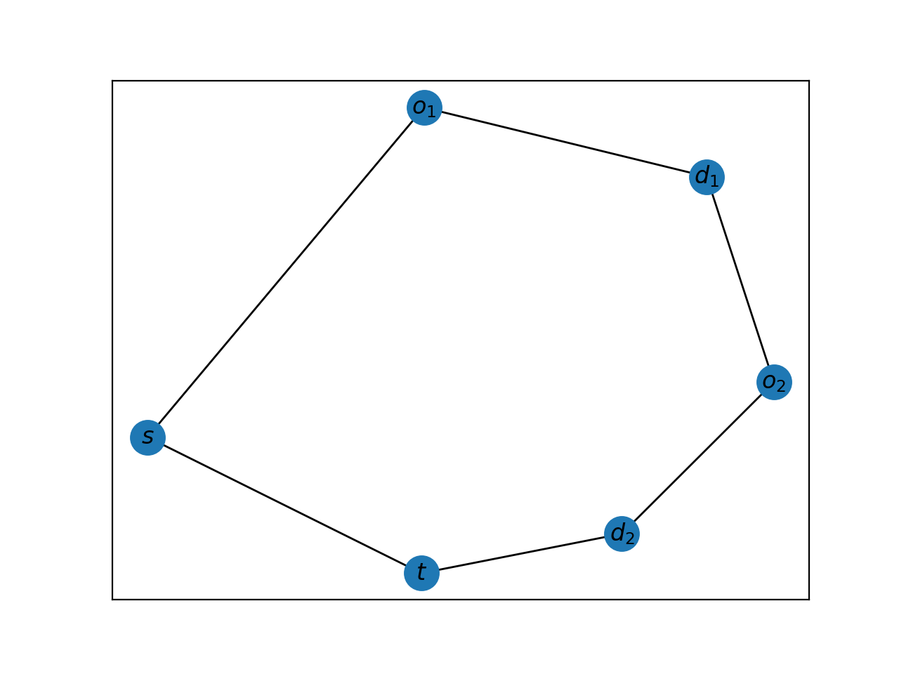
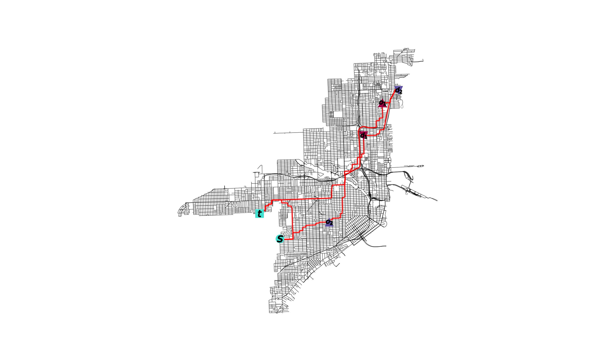

============
Introduction
============

The ``pdppy`` package consists of four :ref:`modules<Modules>`:

* :ref:`Instances` handles input graphical instances for solving,
* :ref:`Algorithms` provides implementations for solving provided PDP instances,
* :ref:`Plot` creates visualizations of instances and their solutions, and
* :ref:`Helper` assists each module in the handling of instances.

The main takeaway from this structure is that the user provides inputs to any one of the functions in the ``instances.py`` module. 
Then, the outputs from the ``instances.py`` module can be fed directly as inputs to any one of the functions in the ``algorithms.py`` module. 
The outputs from the ``algorithms.py`` and ``instances.py`` module can then be viewed in conjunction through the ``plot.py`` module.

.. note::

   This package utilizes two key Python packages: 
   `NetworkX <https://networkx.github.io/documentation/stable/>`_ and `OSMnx <https://osmnx.readthedocs.io/en/stable/#>`_.

Installation
============

Download from `github <https://github.com/adrianhdz8/pdppy>`_.

Basics
======

Learn how to use the pdppy module!

Import Package
--------------

Documentation assumes package was imported as follows.

>>> import pdppy as pdp

Nodes
-----

Nodes in the graphical instances carry the necessary information for applying any method in ``algorithms.py``. Nodes in a graph can either be a source node **s**, a target node **t**, or part of an origin-destination request pair. For this version of the PDP, there can be only one **s** and one **t** and as many as **k** request pairs, each containing an origin (codified as *'o'*) and a destination (codified as *'d'*). 

In the instances module, the user may provide values for each of these entries to obtain a desired :ref:`request graph<Request (PDP) Graph>`. The values for **s** and **t** can be any singular nodes found in the original :ref:`input graph<Input Graph>`. The values for the **request_pairs** must be a list containing each node pair from the original graph to be treated as a request *[(o_1, d_1), ..., (o_k, d_k)]*; here the 'request type' is *'o'* or *'d'*, and the 'request number' is *1* through *k* for each request pair. If these values are not supplied, a pseudo-random selection of nodes will be chosen from the input graph. 

When the request graph is output by the ``instances.py`` module from the user's input, the node labelling is changed for simplification in the ``algorithms.py`` module. The original node labels are preserved in the node attribute **'original'** of the outputted request graph.

For example, if a node *'y'* in the original graph **G** is arbitrarily labelled as *3* in the resulting request graph **H**, then:

>>> H.node[3]['original']
'y'

As mentioned above, failure by the user to specify the nodes for **s**, **t**, and **request_pairs** from the input graph in the :ref:`instances.request\_graph<Instances>` function will result in a random selection of these nodes from the input graph. The seed used for this random selection will be stored as a graph attribute of the output graph under the name *'seed'* so that the graph may be reproduced by the user. 

For example, if the computer had set the seed to be *123456*, then:

>>> H.graph['seed']
123456

Graphs
------

All PDP instances are represented as graphs and are handled as `NetworkX <https://networkx.github.io/documentation/stable/>`_ graph objects. 
The graphs handled in this package fall into one of three classifications.

Input Graph
^^^^^^^^^^^

An input graph **G** is a user-provided graph for the ``instaces.py`` module and should meet the following criteria:

* The edges of **G** are undirected: **(u, v) = (v, u)** and have associated positive weight
* **G** is connected (any node is reachable from any other node along the edges of **G**)
* The edges of **G** have associated positive weight  

Take the following example with user-provided **G**:

>>> import networkx as nx
>>> G = nx.Graph()
>>> G.add_weighted_edges_from([(1, 3, 1.23), (3, 4, 5),('c', 3, 2), (8, 1, 3.6), (1, 'x', 8), ('x', 'y', 10),(4, 'x', 6.4), ('c', 'x', 4.3)])
>>> list(G.nodes())
[1, 3, 4, 8, 'x', 'y', 'c']
>>> nx.is_directed(G)
False
>>> nx.is_connected(G)
True
>>> G.edges[1,3]
{'weight': 1.23}

Request (PDP) Graph
^^^^^^^^^^^^^^^^^^^

A request graph **H** is a modification of the input/generated graph **G** by the ``instances.py`` module. 
This graph follows a strict structure in the information it carries for the usage of all the modules and, as 
a result, should not be modified after it has been produced by any of the ``instances.py`` functions.

**H** is a NetworkX graph that:

* Satisfies the criteria of the :ref:`input graph<Input Graph>` **G**
* Contains only the user-specified nodes from **G** that will make up the **s**, **t**, and **request_pairs** nodes
* Is metrically closed (complete) over all its nodes
* Stores the additional graph attributes seen below (accessible through **H.graph['attribute_name']**)

User inputs of **s = 3**, **t = 8**, and **request_pairs = [(1, 4), ('x', 'y')]** on the above example :ref:`input graph<Input Graph>` **G** produce a request graph **H** that will be a metric closure on these nodes and have the following nodes and attributes:

>>> list(H.nodes())
[1, 3, 4, 8, 'x', 'y']
>>> H.graph['s']
3
>>> H.graph['t']
8
>>> H.graph['requests']
{3: (0, 's'), 8: (0, 't'), 1: (1, 'o'), 4: (1, 'd'), 'x': (2, 'o'), 'y': (2, 'd')}

Tour Graph
^^^^^^^^^^

A tour graph **P** is a graphical representation of the solution produced by one of the methods in the ``algorithms.py`` module. It contains all the nodes in the request graph and contains only the edges that appear in the solution. The tour graph **P** contains two additional graph attributes **'dist'** for the total tour distance and **'type'** for the method in ``algorithms.py`` used to produce **P**.

For example, if **P** had a total tour distance of 5.8 and was computed by :ref:`algorithms.cheapest\_feasible\_insertion<Algorithms>` which has type code 'CFI', then:

>>> P.graph['dist']
5.8
>>> P.graph['type']
'CFI'

The edges of **P** contain an attribute *'value'* which hold the edge's value in the solution. The values associated with this attribute should be **1** for every edge from all methods with the exception of the tours produced by the :ref:`algorithms.linear\_prog<Algorithms>` method which may have fractional values corresponding to the non-integer solution values found by the linear programming solver. 

Tutorial
========

This is a complete example for the use of the different modules and the functions within.

:ref:`Import<Import Package>` the modules, the NetworkX package, and any others you may need.

>>> import pdppy as pdp
>>> import networkx as nx

Supply your own NetworkX :ref:`input graph<Input Graph>` **G** and nodes for selection. 

>>> G = nx.Graph()
>>> G.add_weighted_edges_from([(1, 3, 1.23), (3, 4, 5),('c', 3, 2), (8, 1, 3.6), (1, 'x', 8), ('x', 'y', 10),(4, 'x', 6.4), ('c', 'x', 4.3)])
>>> H = pdp.instances.request_graph(G, 3, 8, [(1, 4), ('x', 'y')])

Or, use the :ref:`instances.random\_geo\_graph<Instances>` function to generate an input and request graph with *3* request pairs and a seed of *10001*.

>>> G2, H2 = pdp.instances.random_geo_graph(3, 10001)

Using the request graph, compute the solution using one of the methods in ``algorithms.py``.

>>> P = pdp.algorithms.path_build_alg(H)

Analyze and visualize the solution using the function :ref:`plot.plot\_tour<Plot>`.

>>> P.graph['dist']
49.82
>>> pdp.plot.plot_tour(P)

For working with an OSMnx graph, simply use the :ref:`instances.city\_graph<Instances>` function and query the desired city through the **city** parameter.

>>> import pdppy as pdp
>>> import networkx as nx
>>> G, H = pdp.instances.city_graph('Miami, USA', k=3, seed=10001)

The road network could also be supplied by the user in the case changes were made to the road network graph by the user.

>>> import osmnx as ox
>>> G = ox.graph_from_place('Miami, USA', network_type='drive')
>>> G = 

>>> P = pdp.algorithms.four_traversal_mst_alg(H)
>>> P.graph['dist']
37243.63

Can overlay tour **P** on OSMnx graph **G**.

>>> pdp.plot.plot_tour(P, G)

